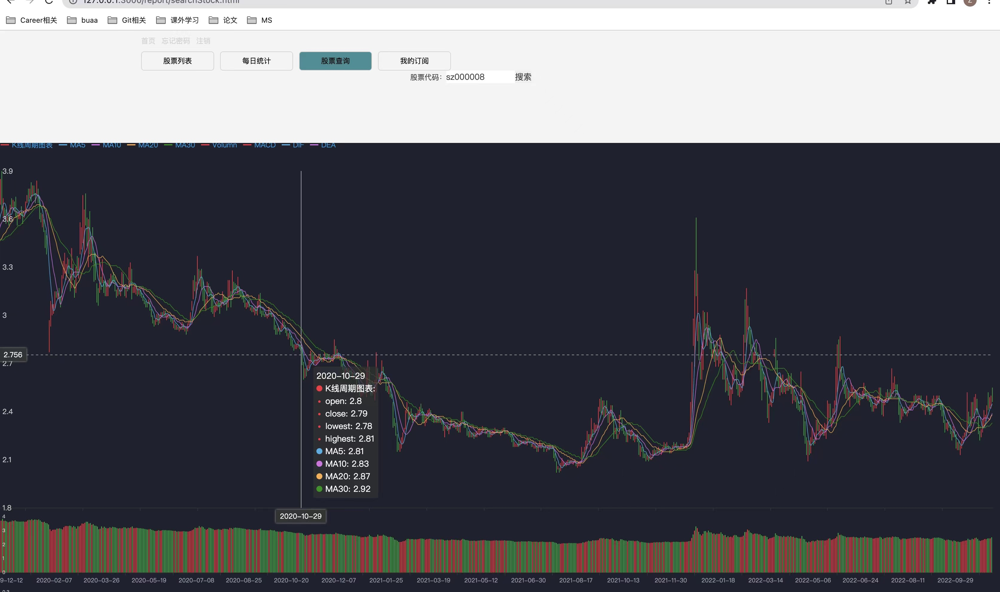
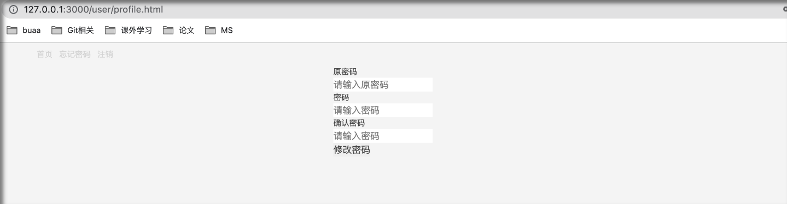
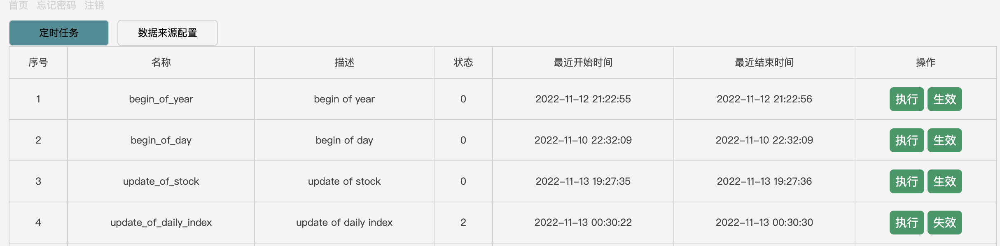
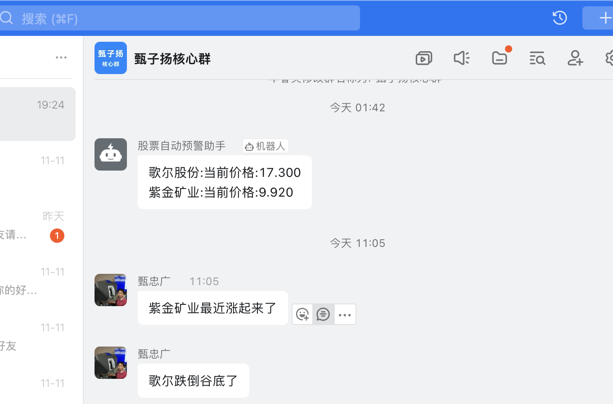
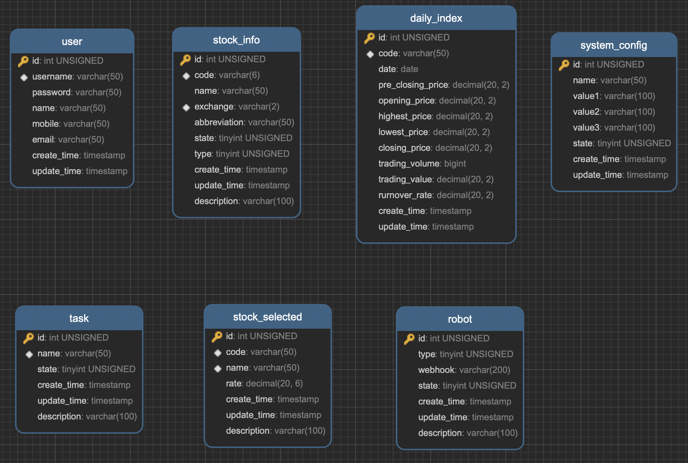

# market-analysis
该项目包含了前端+后端的股票行情监控与可视化系统。可以直接运行启动。




系统设计文档： [设计文档](https://github.com/16372212/market-analysis/blob/main/%E8%AE%BE%E8%AE%A1%E6%96%87%E6%A1%A3.md)

每日工作计划： [工作计划与日报](https://github.com/16372212/market-analysis/blob/main/%E6%AF%8F%E6%97%A5%E5%B7%A5%E4%BD%9C%E8%AE%A1%E5%88%92.md)


# 1 项目配置与启动

## 1.1 环境配置

安装mysql8.0
安装Jdk
安装gradle
安装node

## 1.2 项目目录

```java
- 代码
    - backend/  //后端代码
    - frontend/  //前端代码
    - wiki/  //数据库执行代码
- 每日工作计划.md
- 设计文档.md
- READEME.md
- pic/  // md文档以来的图片
- 行情中心-甄子扬.pptx
```

## 1.3 配置数据库

登录mysql, 创建一个数据库名为 stock_master 的库

运行wiki包下的`create_table.sql`, `insert_ini_data.sql`

## 1.4 启动服务端

1. 修改配置文件 `application.yml`里面的Redis、Mysql的登陆信息

2. build/bootJar项目

3. `java -jar build/libs/stock-service-0.0.1.jar`

## 1.5 启动前端

进入前端目录后执行

```
npm install

npm start
```
## 1.6 日志文件

在 `backend/logs/`下可以看到

## 1.7 用户使用方法

访问、查询功能、订阅功能、可视化可见行情管理界面

自动Task执行与手动任务执行可见系统管理界面


## 1.8 其他注意事项:

> 先配置好数据库再启动程序. 数据库的数据死活读不到的时候先查看缓存的数据, 不对的话到系统管理页面清理缓存.


## 1.9. 系统技术选型

数据库使用：Mysql、Redis、Caffeine

选型原因：持久性、速度(本地缓存 > 内存缓存 > Mysql) 

数据库存储内容：
- Mysql: 所有数据
- Redis: 股票基本信息
- Caffeine: 股票基本信息


# 2 系统描述

## 2.1 系统功能

### 2.1.1 用户登陆注册鉴权：

- 1.用户登录权

- 2.用户忘记密码

- 3. 用户鉴权

- 4. 用户自动登陆




接口设计

```
curl --location --request POST 'http://127.0.0.1:2222/user/login' \
--form 'username="wild"' \
--form 'password="123456"'

```

返回结构体
```
{
    "username": "wild",
    "name": "wild",
    "mobile": "",
    "email": "",
    "token": "ce2f61befcaa42249509ec39ae75aec6"
}
```

### 2.1.2 股票行情导入

#### 数据来源：

使用**新浪**和**东方财富**接口进行数据导入。

sina:
```java
// "http://money.finance.sina.com.cn/quotes_service/api/json_v2.php/CN_MarketData.getKLineData?symbol=%d&scale=5&ma=5&datalen=500"

@Override
    public String getHistoryDailyIndexsStringFromSina(String code, int year, int season) {
        return HttpUtil.sendGet(httpClient, String.format("http://money.finance.sina.com.cn/quotes_service/api/json_v2.php/CN_MarketData.getKLineData?symbol=%d&scale=5&ma=5&datalen=500", code));
    }

```

东方财富：
```java
// https://finance.sina.com.cn/

@Override
    public List<DailyIndex> getDailyIndex(List<String> codeList) {
        String codes = codeList.stream().map(StockUtil::getFullCode).collect(Collectors.joining(","));
        HashMap<String, String> header = new HashMap<>();
        header.put("Referer", "https://finance.sina.com.cn/");
        String content = HttpUtil.sendGet(httpClient, "https://hq.sinajs.cn/list=" + codes, header, "gbk");
        if (content != null) {
            return dailyIndexParser.parseDailyIndexList(content);
        }
        return Collections.emptyList();
    }
```
#### 导入方式

支持手动导入、也可以支持生效以后的自动导入。自动导入这里有一个开关，用户可以去控制这个自动执行的开关。



> 方式1:【执行】用户手动导入一次

手动执行一次导入任务：

接口设计：
```shell
curl --location --request POST 'http://127.0.0.1:2222/system/executeTask' \
--header 'auth-token: 964d1576d5fb4b18be6b29258f4a33cc' \
--form 'id="3"'

```

返回结构体：
```shell
{
    "message": "ok"
}
```

> 方式2:【生效】开启自动导入任务：

设置Scheduled定时任务，每隔一定时间信息更新

```java
@Scheduled(cron = "0 1 17,18,19 ? * MON-FRI")
    public void runUpdateOfDailyIndex() {
        if (isNotBusinessDate()) {
            return;
        }

        try {
            List<ExecuteInfo> list = taskService.getPendingTaskListById(Task.UpdateOfDailyIndex.getId());
            executeTask(list);
        } catch (Exception e) {
            logger.error("task runUpdateOfDailyIndex error", e);
        }
    }
```

### 2.1.3 股票行情查询

### 2.1.4 前端股票五档数据可视化


### 2.1.5 行情可监控
支持用户订阅相关股票，并基于行情变化主动推送钉钉消息


策略：根据换手率的变化与否推送用户订阅的股票信息。

> “换手率”也称“周转率”，指在一定时间内市场中股票转手买卖的频率，是反映股票流通性强弱的指标之一。 计算公式：换手率＝ 某一段时期内的成交量／流通股数×１００％。 将换手率与个股股价走势相结合，可以对未来的股价作出一定的预测和判断： 股票的换手率越高，意味着该只股票的交投越活跃，属于热门股。



### 2.1.6 行情存储对象抽象统一


| **订阅股票**   | 注册的用户可以获得选择股票进行订阅             |
| **行情信息导入**     | 系统每天固定时间点从接口获得交易所股票买卖⾏情，并更新到数据库                           |
| **股票行情可视化**   | 支持将股票出5档⾏情走势按照图表形式绘制出来         |
| **更新股票热榜**     | 该功能在用户访问产品时触发，根据一定规则，计算股票的热度，对股票热榜进行更新｜             |
| **股票行情监控**     | 监控用户订阅的股票产品，并根据一定规则，基于⾏情变化对用户做出相应的提醒｜             |
| **⾏情信息⼴播推送**     | 将用户订阅的股票信息推送到系统首页，并按需发短信提醒 ｜             |


## 2.2 模型设计



### 2.1 用户模块
```sql

CREATE TABLE `user` (
  `id` int(11) unsigned NOT NULL AUTO_INCREMENT,
  `username` varchar(50) NOT NULL,
  `password` varchar(50) NOT NULL,
  `name` varchar(50) NOT NULL NOT NULL DEFAULT '',
  `mobile` varchar(50) NOT NULL DEFAULT '',
  `email` varchar(50) NOT NULL DEFAULT '',
  `create_time` timestamp NOT NULL DEFAULT CURRENT_TIMESTAMP,
  `update_time` timestamp NOT NULL DEFAULT CURRENT_TIMESTAMP ON UPDATE CURRENT_TIMESTAMP,
  PRIMARY KEY (`id`),
  UNIQUE KEY `uk_username` (`username`)
) ENGINE=InnoDB;

```
### 2.2 行情导入模块

股票基本信息

```sql

CREATE TABLE `stock_info` (
  `id` int(11) unsigned NOT NULL AUTO_INCREMENT,
  `code` varchar(6) NOT NULL,
  `name` varchar(50) NOT NULL,
  `exchange` varchar(2) NOT NULL,
  `abbreviation` varchar(50) NOT NULL,
  `state` tinyint(4) unsigned NOT NULL DEFAULT '0',
  `type` tinyint(4) unsigned NOT NULL DEFAULT '0',
  `create_time` timestamp NOT NULL DEFAULT CURRENT_TIMESTAMP,
  `update_time` timestamp NOT NULL DEFAULT CURRENT_TIMESTAMP ON UPDATE CURRENT_TIMESTAMP,
  `description` varchar(100) NOT NULL DEFAULT '',
  PRIMARY KEY (`id`),
  UNIQUE KEY `uk_exchange_code` (`exchange`,`code`)
) ENGINE=InnoDB;

```

股票行情信息

```sql

CREATE TABLE `daily_index` (
  `id` int(11) unsigned NOT NULL AUTO_INCREMENT,
  `code` varchar(50) NOT NULL,
  `date` date NOT NULL,
  `pre_closing_price` decimal(20, 2) NOT NULL,
  `opening_price` decimal(20, 2) NOT NULL,
  `highest_price` decimal(20, 2) NOT NULL,
  `lowest_price` decimal(20, 2) NOT NULL,
  `closing_price` decimal(20, 2) NOT NULL,
  `trading_volume` bigint NOT NULL,
  `trading_value` decimal(20, 2) NOT NULL,
  `rurnover_rate` decimal(20, 2) NOT NULL,
  `create_time` TIMESTAMP NOT NULL DEFAULT CURRENT_TIMESTAMP,
  `update_time` TIMESTAMP NOT NULL DEFAULT CURRENT_TIMESTAMP ON UPDATE CURRENT_TIMESTAMP,
  PRIMARY KEY (`id`),
  KEY `ik_code` (`code`)
) ENGINE=InnoDB;

```

数据源管理
```sql

CREATE TABLE `system_config` (
  `id` int(11) unsigned NOT NULL AUTO_INCREMENT,
  `name` varchar(50) NOT NULL,
  `value1` varchar(100) NOT NULL,
  `value2` varchar(100) NOT NULL DEFAULT '',
  `value3` varchar(100) NOT NULL DEFAULT '',
  `state` tinyint(4) unsigned NOT NULL DEFAULT '1',
  `create_time` timestamp NOT NULL DEFAULT CURRENT_TIMESTAMP,
  `update_time` timestamp NOT NULL DEFAULT CURRENT_TIMESTAMP ON UPDATE CURRENT_TIMESTAMP,
  PRIMARY KEY (`id`)
) ENGINE=InnoDB;

```

### 2.2 定时任务模块

```sql

CREATE TABLE `task` (
  `id` int(11) unsigned NOT NULL AUTO_INCREMENT,
  `name` varchar(50) NOT NULL,
  `state` tinyint(4) unsigned NOT NULL,
  `create_time` TIMESTAMP NOT NULL DEFAULT CURRENT_TIMESTAMP,
  `update_time` TIMESTAMP NOT NULL DEFAULT CURRENT_TIMESTAMP ON UPDATE CURRENT_TIMESTAMP,
  `description` varchar(100) NOT NULL DEFAULT '',
  PRIMARY KEY (`id`),
  UNIQUE KEY `uk_name` (`name`)
) ENGINE=InnoDB;

```

### 2.3 股票订阅与监控模块

用户订阅的股票：

```sql

CREATE TABLE `stock_selected` (
  `id` int(11) unsigned NOT NULL AUTO_INCREMENT,
  `code` varchar(50) NOT NULL UNIQUE,
  `name` varchar(50) NOT NULL UNIQUE,
  `rate` decimal(20, 6) NOT NULL DEFAULT '0.02',
  `create_time` TIMESTAMP NOT NULL DEFAULT CURRENT_TIMESTAMP,
  `update_time` TIMESTAMP NOT NULL DEFAULT CURRENT_TIMESTAMP ON UPDATE CURRENT_TIMESTAMP,
  `description` varchar(100) NOT NULL DEFAULT '',
  PRIMARY KEY (`id`)
) ENGINE=InnoDB;

```

监控并发送钉钉消息：

```sql

CREATE TABLE `robot` (
  `id` int(11) unsigned NOT NULL AUTO_INCREMENT,
  `type` tinyint(4) unsigned NOT NULL DEFAULT '0',
  `webhook` varchar(200) NOT NULL DEFAULT '',
  `state` tinyint(4) unsigned NOT NULL DEFAULT '0',
  `create_time` TIMESTAMP NOT NULL DEFAULT CURRENT_TIMESTAMP,
  `update_time` TIMESTAMP NOT NULL DEFAULT CURRENT_TIMESTAMP ON UPDATE CURRENT_TIMESTAMP,
  `description` varchar(100) NOT NULL DEFAULT '',
  PRIMARY KEY (`id`)
) ENGINE=InnoDB;

```

## 2.3 接口设计

### 请求值和返回值


## 2.4 代码分层设计


# 3. 具体需求

## 3.1 外部接口需求

### 3.1.1 用户界面

1. 注册登陆界面
2. 首页
3. 股票行情信息展示界面
5. 个人中心

### 3.1.2 软件接口

- MacOS 操作系统；
- Aapche Kafka；
- etcd v3.4.15；
- Nginx 1.19.8。

### 3.1.3 通信接口

HTTPS协议、TCP/IP协议。

## 3.2 功能需求

### 3.2.1 web模块

#### 3.2.1.1 注册账号、修改密码
| **用例名**             | **注册账号**                                                                                                                        |
|---------------------|---------------------------------------------------------------------------------------------------------------------------------|
| **基本事件流**           | (1) 用户打开注册页面 <br>(2) 用户填写密码，用户名等身份信息(A-1)(A-2) <br>(3) 用户点击注册按钮 <br>(4) 系统验证该用户信息是否符合规范 <br>(5) 系统验证该用户名是否被注册过 <br>(6) 系统返回注册结果 |
| **备选事件流**           | A-1 用户信息不符合规范<br>(1) 系统提示信息不符合规范 <br>  (2) 用户重新输入 <br>A-2 用户被注册过<br>  (1) 系统提示用户用户名重复 <br>  (2) 用户重新输入                          |
| **补充约束<br>- 数据约束**  | (1) 密码不能为空 <br>(2) 电话不能为空                                                                                                       |
| **补充约束<br>- 非功能需求** | 系统响应时间不超过15秒                                                                                                                    |


#### 3.2.1.2 登录账号

| **用例名**             | **登录账号**                                                                                                                                                                                                 |
|---------------------|----------------------------------------------------------------------------------------------------------------------------------------------------------------------------------------------------------|
| **基本事件流**           | (1) 用例起始于未登录用户想要登录系统 <br>(2) 未登录用户点击【登录】按钮，系统跳转到登录页面(A-1) <br>(3) 用户在登录页面填入相关信息(D-1)，点击【登录】(A-2)(A-3)(A-4)                                                                                               |
| **备选事件流**           | A-1 系统繁忙或网络出现问题<br>(1) 系统提示：系统繁忙，请稍后再试<br>A-2 用户的账户未注册 <br>(1) 系统提示：该账户不存在，请注册后再使用<br>(2) 系统跳转到注册页面<br>A-3 用户登录成功 <br> (1) 系统提示：登录成功 <br>  (2) 系统跳转到主页或用户之前浏览的页面<br>A-4 用户登录失败<br>(1) 系统提示：登录信息不正确，请重新输入 |
| **补充约束<br>- 数据约束**  | D-1 提交的数据需要包含账户名，密码                                                                                                                                                                                      |
| **补充约束<br>- 非功能需求** | 无                                                                                                                                                                                                        |

#### 3.2.1.3 订阅股票
| **用例名**             | **订阅股票**                             |
|---------------------|--------------------------------------|
| **基本事件流**           | (1) 点击订阅，输入股票编号 <br>(2) 系统提示订阅成功并修改数据库(A-1) |
| **备选事件流**           | A-1 系统繁忙或网络出现问题<br>系统提示：系统繁忙，请稍后再试   |
| **补充约束<br>- 数据需求**  | 提交数据包括用户字段和股票编号                   |
| **补充约束<br>- 非功能需求** | 暂无                                   |


#### 3.2.1.4 行情信息导入
| **用例名**         | 行情信息导入                                |
|-----------------|--------------------------------------------------------------------------|
| **基本事件流**       | 系统固定时间自发从接口获得交易所股票买卖行情信息，并针对信息进行相关的数据计算、处理等  |
| **备选事件流**       | 暂无   |
| **补充约束- 数据需求**  | 暂无              |
| **补充约束- 非功能需求** | 暂无             |


#### 3.2.1.5 更新股票热榜
| **用例名**         | 更新股票热榜                      |
|-----------------|--------------------------------------------------------------------------|
| **基本事件流**       | 用户访问产品时触发，现实当前股票热度从上往下前10个股票的具体行情信息  |
| **备选事件流**       | 暂无   |
| **补充约束- 数据需求**  | 暂无              |
| **补充约束- 非功能需求** | 暂无             |


#### 3.2.1.6 股票行情监控


| **用例名**             | **股票行情监控**           |
|---------------------|---------------------------------------------------------------------------------------------------------------------------------|
| **基本事件流**           | (1) 用户打开首页面 <br>(2) 系统显示该用户订阅过的股票行情数据 |
| **备选事件流**           | A-1 用户未订阅股票<br>(1) 系统提示您未订阅股票 <br>   |
| **补充约束<br>- 数据约束**  | (1) 暂无                            |
| **补充约束<br>- 非功能需求** | 系统响应时间不超过15秒 |


#### 3.2.1.7 行情信息广播推送


| **用例名**             | **行情信息广播推送**           |
|---------------------|---------------------------------------------------------------------------------------------------------------------------------|
| **基本事件流**           | (1) 用户打开首页面 <br>(2) 系统监控用户选择的股票，判断换手率是否变化（3）若变化，则系统发送钉钉群提醒。 |
| **备选事件流**           | A-1 用户未订阅股票<br>(1) 无任何消息 <br>   |
| **补充约束<br>- 数据约束**  | 暂无                            |
| **补充约束<br>- 非功能需求** |暂无|
                                      
# 4. 进度

必须⽬标： 
1. ⽀持上海或深圳交易所股票买卖⾏情信息导⼊（可以从互联⽹上取） 						Done
2. 需要⽀持⾼性能接收，⾼性能发布                           											Done
3. ⾏情查询界⾯，输⼊股票代码可以查出5档⾏情  											Done

可选⽬标： 

1. 开发前端界⾯绘制⾏情⾛势（参考腾讯分时⾏情绘制⾯版） 								Done
2. 框架可扩展，后续可以通过插件⽅式接⼊各期货交易所及全球主要市场⾏情  				Todo
3. ⾏情可监控，未来可以开发各种监控程序，基于⾏情变化做相应的提醒或⾃动下指令处理。	Done 
4. ⾏情存储对象抽象统⼀。  																	Done

# 5. 未来方向

1）框架可扩展，后续可以通过插件⽅式接⼊各期货交易所及全球主要市场⾏情
2）用户登录需要更多的隐私性保护策略（密码找回、验证码支持等）

